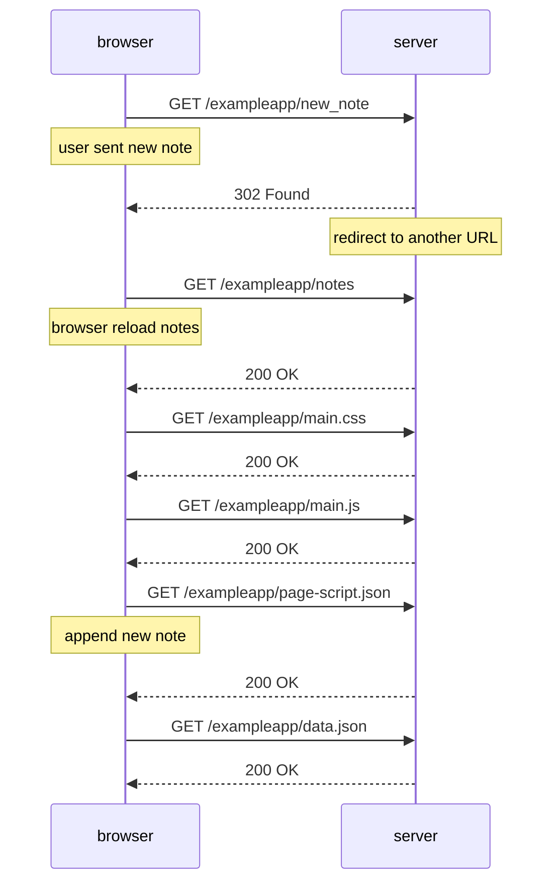

```mermaid
sequenceDiagram
    participant browser
    participant server

    browser->>server: GET /exampleapp/new_note
    Note over browser: user sent new note
    server-->>browser: 302 Found
    Note over server: redirect to another URL

    browser->>server: GET /exampleapp/notes
    Note over browser: browser reload notes
    server-->>browser: 200 OK

    browser->>server: GET /exampleapp/main.css
    server-->>browser: 200 OK

    browser->>server: GET /exampleapp/main.js
    server-->>browser: 200 OK

    browser->>server: GET /exampleapp/page-script.json
    Note over browser: append new note
    server-->>browser: 200 OK

    browser->>server: GET /exampleapp/data.json
    server-->>browser: 200 OK
```
